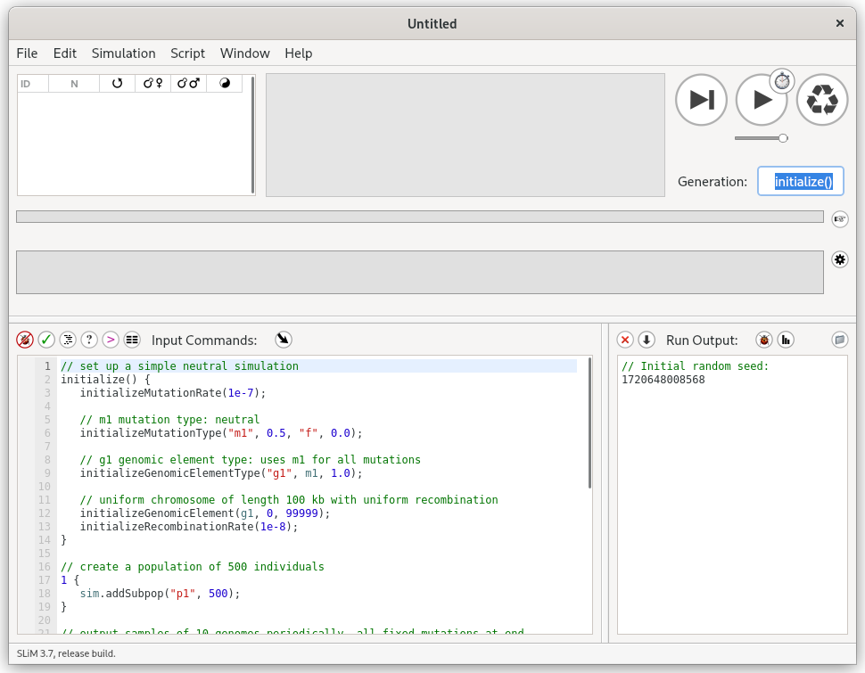

# Previous Experience Packaging
I packaged [SLiM for Fedora, CentOS, Red Hat Enterprise, and
openSUSE](https://copr.fedorainfracloud.org/coprs/bacarson/SLiM-Selection_on_Linked_Mutations/)
over a year ago. Learning how to package software in the RPM format did take
some time, but it was not too difficult after I read the excellent documentation
and did some internet searches for various macros where the documentation did
not specify (because it had not been updated, or the macro was
distribution-specific and I would've needed to consult that specific
documentation).

-------------------------------------------------------------------------------

# *SLiM: Selection on Linked Mutations* Simulation Framework

# Debian Packaging
## Ubuntu Packaging
